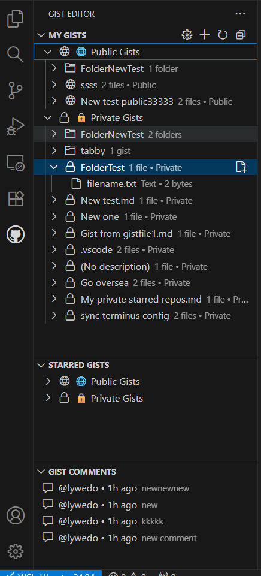
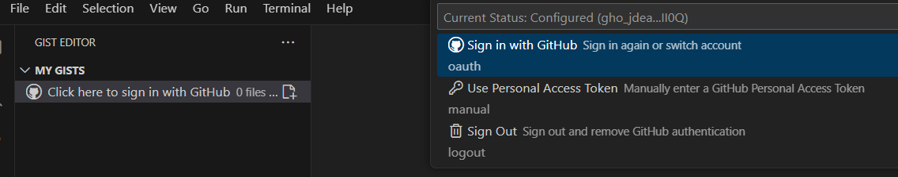
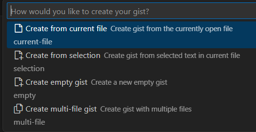

# 🚀 Gist Editor for VS Code

<div align="center">

[](https://marketplace.visualstudio.com/items?itemName=lywedo.gist-editor)
[](./LICENSE)
[](https://github.com/lywedo/gist-editor/pulls)

**The most intuitive and lightweight GitHub Gist manager for VS Code**  
*Organize, edit, and manage your code snippets with a revolutionary folder hierarchy system*

[**Install Now**](https://marketplace.visualstudio.com/items?itemName=lywedo.gist-editor) • [Report Bug](https://github.com/lywedo/gist-editor/issues) • [Request Feature](https://github.com/lywedo/gist-editor/issues)

</div>

---

## ✨ Why Gist Editor?

Finally, a Gist manager that **thinks like a developer**. No more flat lists of hundreds of gists. No more lost snippets. Just pure, organized productivity.

### 🎯 **Key Highlights**

- 📁 **Revolutionary Folder Organization** - First VS Code extension to offer true hierarchical folder structure for gists
- 🎯 **Intuitive Drag & Drop** - Effortlessly reorganize gists and move files between gists
- ⚡ **Lightning Fast** - Intelligent caching system ensures instant access to your code snippets
- 🎨 **Beautiful & Intuitive UI** - Clean, native VS Code interface that feels right at home
- 🔐 **Seamless GitHub OAuth** - One-click authentication, no token hassles
- 💾 **Auto-Save Magic** - Edit and save gists as naturally as local files

## 🎬 See It 

<!-- Add your screenshots/GIFs here -->


---

## 🌟 Revolutionary Features

### 📂 **Hierarchical Folder Organization**
*The game-changer you've been waiting for*

Transform your chaotic gist collection into a beautifully organized knowledge base:

```
📁 React
  ├── 📁 Components
  │   ├── 📄 Button Component
  │   └── 📄 Modal Hook
  ├── 📁 Utils
  │   └── 📄 Custom Hooks
  └── 📄 Context Patterns

📁 Python
  ├── 📁 Scripts
  │   └── 📄 Data Processing
  └── 📁 ML
      └── 📄 TensorFlow Models
```

Simply name your gists with paths like `React/Components - Button Component` and watch the magic happen!

### ⚡ **Lightning-Fast Performance**

- **Smart Caching**: In-memory cache minimizes API calls
- **Lazy Loading**: Gists load on-demand for instant startup
- **Optimized Rendering**: Smooth scrolling even with hundreds of gists
- **Background Sync**: Updates happen seamlessly without blocking your workflow

### 🎨 **Beautiful, Native UI**

- **Seamless Integration**: Looks and feels like native VS Code
- **Theme Support**: Automatically adapts to your VS Code theme
- **Intuitive Icons**: Visual cues for public/private, file types, and actions
- **Clean Sidebar**: Organized views for personal, starred gists, and comments

### 🔒 **Modern Authentication**

- **GitHub OAuth**: One-click sign-in through your browser
- **Secure Token Storage**: VS Code handles your credentials safely
- **Session Persistence**: Stay logged in across sessions
- **Fallback Support**: Manual token option for advanced users

---

## 🚀 Quick Start

### 1️⃣ **Install in 10 Seconds**

```bash
ext install lywedo.gist-editor
```

Or search "Gist Editor" in VS Code Extensions (`Ctrl+Shift+X`)

### 2️⃣ **Sign In with One Click**



1. Click the GitHub icon in the Activity Bar
2. Click "Sign in with GitHub"
3. Authorize in your browser
4. Done! Start managing your gists instantly

### 3️⃣ **Create Your First Organized Gist**



**From Selection** (`Ctrl+Alt+Shift+S`):
- Select code → Right-click → "Create Gist from Selection"

**From File** (`Ctrl+Alt+Shift+G`):
- Open file → Create gist with automatic syntax highlighting

**With Folder Organization**:
- Name it `React/Hooks - useCustomHook` to auto-organize!

---

## 🛠️ Powerful Features

### 🔍 **Intelligent Fuzzy Search**

Find your gists instantly with powerful search capabilities:

**Search Everywhere**:
- 📄 **Gist Names** - Search by gist titles
- 📝 **Descriptions** - Find gists by their descriptions
- 📋 **File Names** - Locate specific files within gists
- 🔎 **Content** - Search through actual file contents

**Smart Fuzzy Matching**:
- **Exact Match** - Perfect word matches ranked highest
- **Substring Match** - Find text anywhere in your gists
- **Fuzzy Match** - Characters don't need to be consecutive (e.g., "rct" finds "React")
- **Position Bonus** - Matches near the beginning score higher

**Intelligent Filtering**:
- 🌐 Filter by public/private visibility
- 📁 Filter by folder path
- 🎨 Filter by programming language
- 🎯 Combine multiple filters for precision search

**Ranking & Results**:
- Results ranked by relevance and match type
- Line numbers for content matches
- Context preview for better visibility
- Top 50 results for quick browsing

### 📝 **Multi-Method Gist Creation**

| Method | Shortcut | Description |
|--------|----------|-------------|
| From Selection | `Ctrl+Alt+Shift+S` | Create gist from selected code |
| From Current File | `Ctrl+Alt+Shift+G` | Turn entire file into a gist |
| Empty Gist | `Ctrl+Alt+G` | Start with a blank gist |
| Multi-file | Via UI | Create gists with multiple files |

### 🗂️ **Smart Organization**

**Automatic Grouping**:
- 🌐 **Public Gists** - Shareable with the world
- 🔒 **Private Gists** - Your secret code vault
- ⭐ **Starred Gists** - Quick access to favorites

**Folder Magic**:
```
Naming Convention: "Folder/Subfolder - Gist Name"
Examples:
  "React/Hooks - Custom Authentication Hook"
  "Python/Utils - Data Processing Scripts"
  "DevOps/Docker - Nginx Configuration"
```

### 💬 **Comment System**

- View all comments on your gists
- Add comments directly from VS Code
- Delete your own comments
- Real-time comment count updates

### 🔄 **Version Control**

- View complete revision history
- Compare different versions
- See who made changes and when
- Restore previous versions if needed

### ⌨️ **Productivity Shortcuts**

| Action | Windows/Linux | macOS | Description |
|--------|--------------|-------|-------------|
| **Save Gist** | `Ctrl+Alt+S` | `Cmd+Alt+S` | Save current gist instantly |
| **Create Gist** | `Ctrl+Alt+G` | `Cmd+Alt+G` | Create new empty gist |
| **From File** | `Ctrl+Alt+Shift+G` | `Cmd+Alt+Shift+G` | Create from current file |
| **From Selection** | `Ctrl+Alt+Shift+S` | `Cmd+Alt+Shift+S` | Create from selected text |

### 📊 **File Management**

Right-click any gist for powerful actions:
- ➕ **Add File** - Expand gists with multiple files
- ✏️ **Rename** - Update descriptions and filenames
- 🌐 **Open in GitHub** - Jump to web interface
- 📜 **View History** - See all revisions
- ⭐ **Star/Unstar** - Mark favorites
- 🗑️ **Delete** - Remove with confirmation

### 🎯 **Drag & Drop Organization**

Effortlessly reorganize your gists with intuitive drag-and-drop:

**Move Gists Between Folders**:
- Drag a gist and drop it on any folder to move it
- Automatically updates gist organization structure
- Works with subfolders and hierarchies

**Move Files Between Gists**:
- Drag files from one gist and drop them on another
- Files are automatically copied to target gist
- Source file is removed after successful transfer
- Preserves file content and language detection

**Example Workflow**:
```
1. Expand "React/Hooks" gist → See its files
2. Drag "useAuth.js" file
3. Drop on "React/Utilities" gist
4. File instantly moved with all content preserved
```

---

## 🎨 Language Support

**100+ Languages with Automatic Detection**:

<table>
<tr>
<td>

**Web Development**
- JavaScript/TypeScript
- HTML/CSS/SCSS
- React/Vue/Svelte
- JSON/XML/YAML

</td>
<td>

**Programming**
- Python/Java/Go
- Rust/C++/C#
- Ruby/PHP/Swift
- Kotlin/Scala

</td>
<td>

**DevOps & Data**
- Dockerfile
- Terraform/HCL
- SQL/GraphQL
- Markdown/LaTeX

</td>
</tr>
</table>

---

## 🔧 Advanced Configuration

### For Power Users

**Manual Token Setup** (Optional):
```json
{
  "gistEditor.githubToken": "ghp_your_token_here"
}
```

**Token Scopes Required**:
- ✅ `gist` - Full gist access

---

## 📈 Why Developers Love Gist Editor

> "**Finally, a gist manager that understands organization!** The folder hierarchy is a game-changer. I can now find my snippets in seconds instead of minutes."  
> — *Senior Full Stack Developer*

> "**Lightweight yet powerful.** Doesn't slow down VS Code startup like other extensions. The caching is brilliant!"  
> — *DevOps Engineer*

> "**The OAuth integration is seamless.** No more managing tokens manually. It just works!"  
> — *Frontend Developer*

---

## 🚦 System Requirements

- **VS Code**: Version 1.104.0 or higher
- **GitHub Account**: Free account works perfectly
- **Internet**: Required for syncing with GitHub

---

## 🐛 Troubleshooting

<details>
<summary><b>Can't see my private gists?</b></summary>

Make sure your token has the `gist` scope:
1. Click the gear icon (⚙️) in the sidebar
2. Select "Sign in with GitHub" again
3. Ensure you authorize the `gist` scope

</details>

<details>
<summary><b>Gists not loading?</b></summary>

1. Check your internet connection
2. Click the refresh button in the sidebar
3. Try signing out and back in

</details>

<details>
<summary><b>Changes not saving?</b></summary>

- Ensure you're using `Ctrl+Alt+S` (or `Cmd+Alt+S` on Mac)
- Check that you're still authenticated
- Verify your internet connection

</details>

---

## 🤝 Contributing

We welcome contributions! See our [Contributing Guide](CONTRIBUTING.md) for details.

```bash
# Clone the repo
git clone https://github.com/lywedo/gist-editor

# Install dependencies
npm install

# Start development
npm run watch
```

---

## 📜 License

MIT License - see [LICENSE](LICENSE) file for details

---

## 🙏 Acknowledgments

- Built with ❤️ for the VS Code community
- Powered by GitHub's Gist API
- Icons from VS Code's Codicon library

---

## 📞 Support

- 🐛 [Report Issues](https://github.com/lywedo/gist-editor/issues)
- 💡 [Request Features](https://github.com/lywedo/gist-editor/issues)
- 📖 [Documentation](https://github.com/lywedo/gist-editor/wiki)
- ⭐ [Star on GitHub](https://github.com/lywedo/gist-editor)

---

<div align="center">

**Made with ❤️ by developers, for developers**

[⬆ Back to Top](#-gist-editor-for-vs-code)

</div>